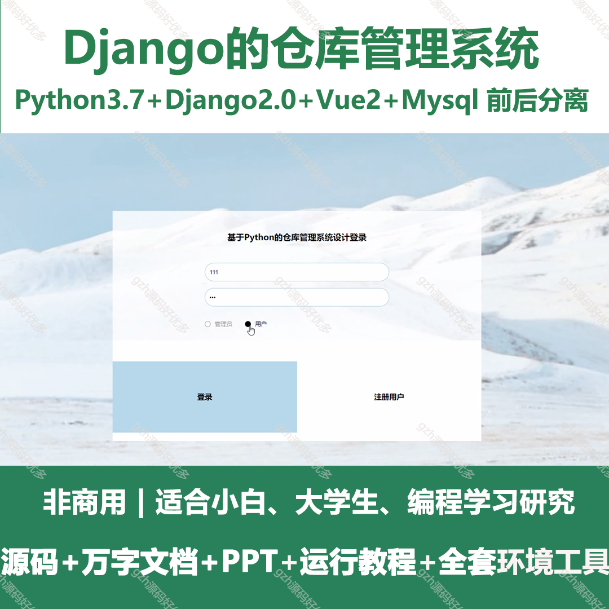
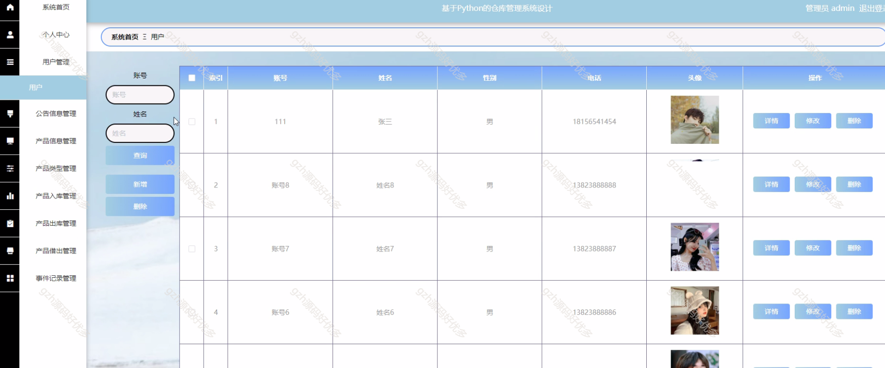
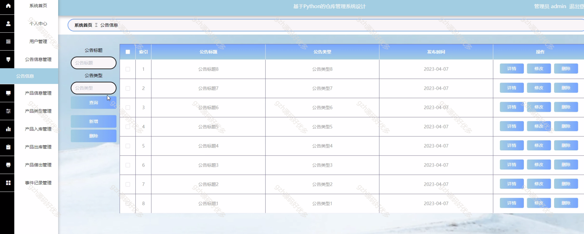
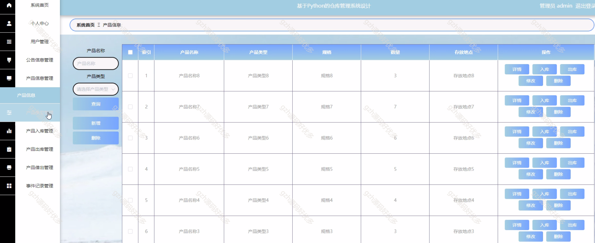
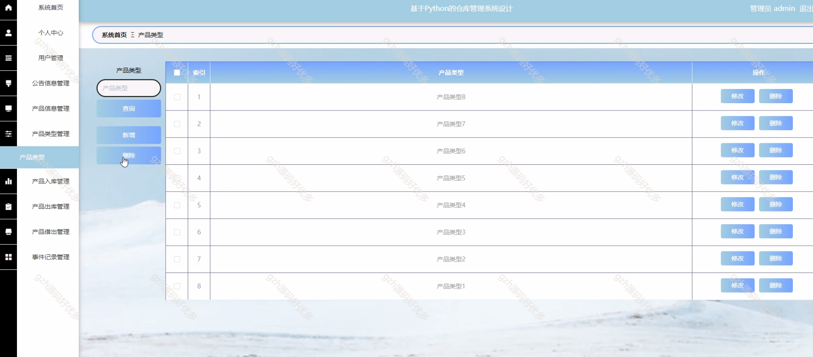
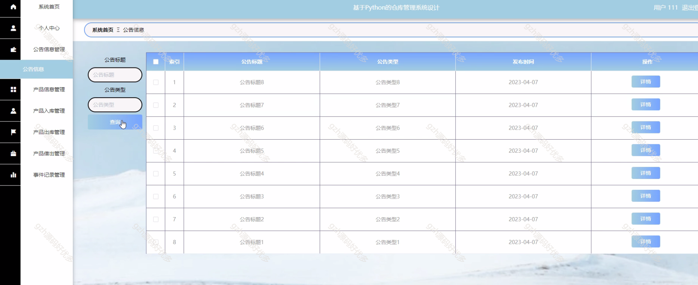
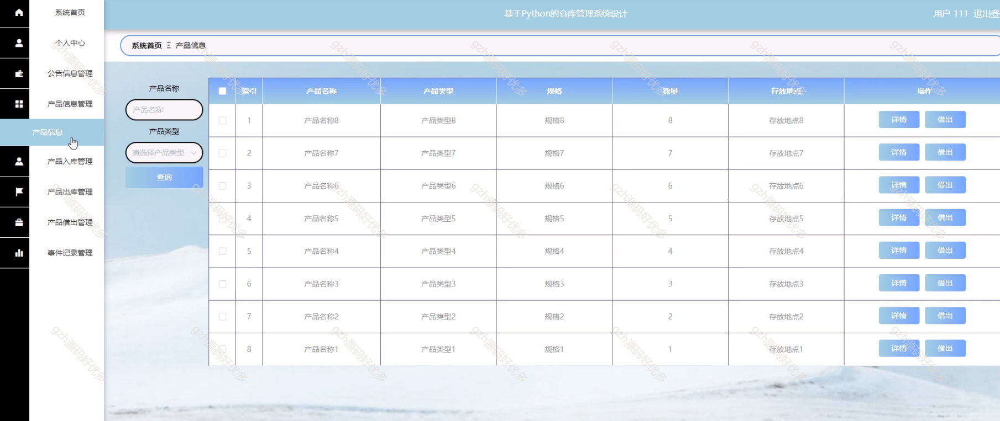
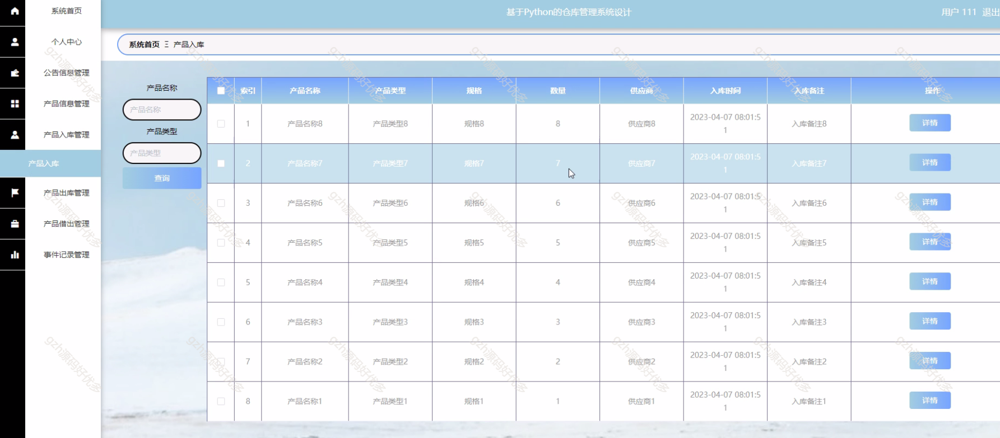
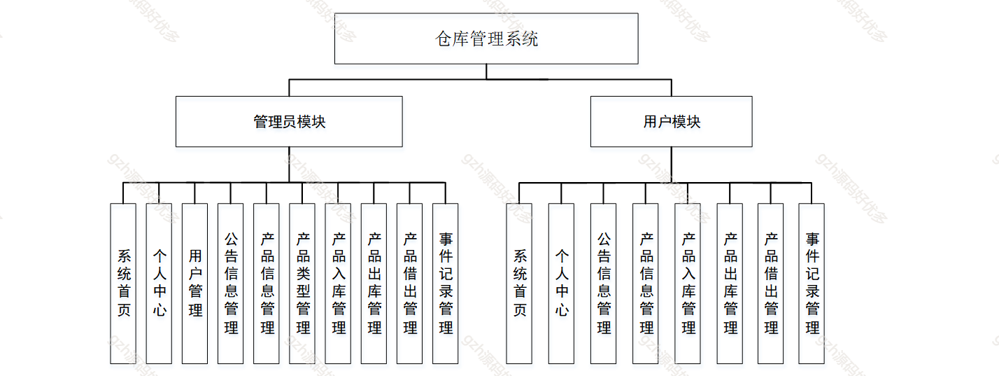
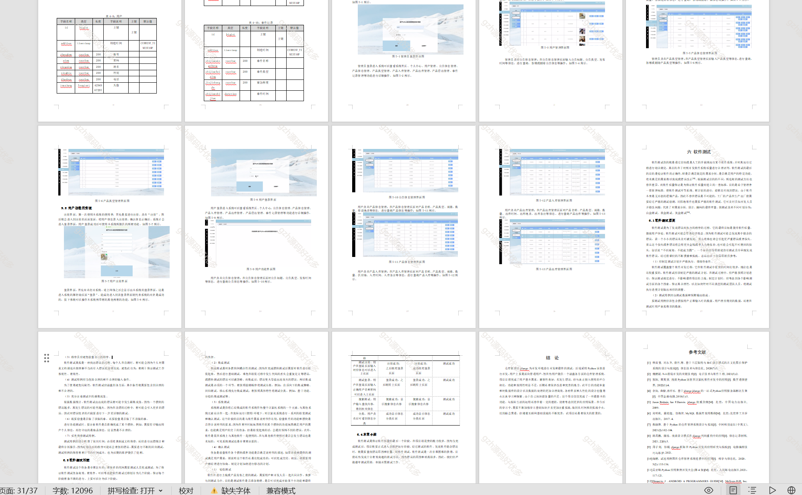

# python016
python016基于Django的仓库管理系统
 
## 查看主页获取源码

### 一、关键词

仓库管理，仓库系统平台，仓储

 

### 二、作品包含

源码+数据库+万字文档+PPT+全套环境和工具资源+部署教程

 

### 三、项目技术

前端技术：Html、Css、Js、Vue2.0、Element-ui
后端技术：Python3.7、Django2.0

  

 

### 四、运行环境（以下版本亲测，其他版本未知，请自测）

开发工具：PyCharm + VSCODE

数据库：MySQL5.7（最低要5.7版本）

数据库管理工具：Navicat10+

Python：Python3.7

前端Nodejs：14

浏览器：谷歌浏览器

 

### 五、项目介绍

项目编号：python016

旨在为管理员和用户提供一个仓库管理系统。用户可以通过系统及时查看产品信息等

仓库管理系统分为管理员与用户模块，管理员可进行系统首页、个人中心、用户及公告、产品全流程（类型、出入库、借出等 ）、事件记录管理；用户能操作系统首页、个人中心、公告及产品信息、出入库、借出、事件记录管理，实现仓库业务数字化管控 。

 

### 六、运行截图

